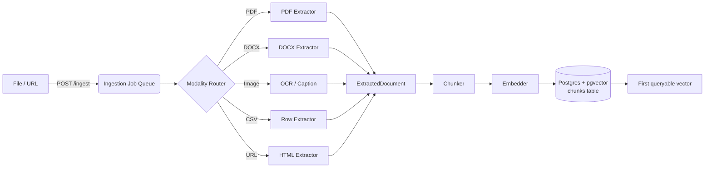
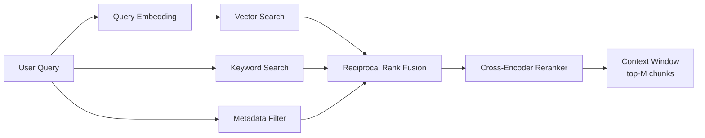
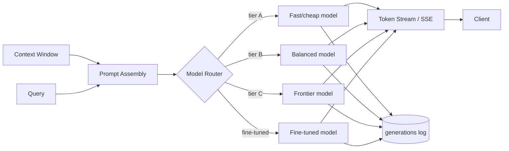
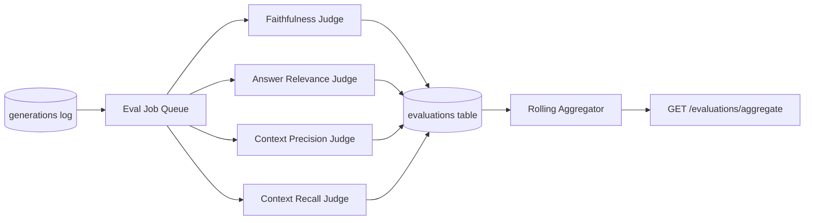
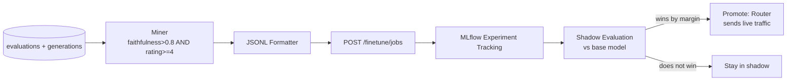

# NeuroFlow Architecture

This document defines the five core subsystems of NeuroFlow, their data flows, and the contracts between them. Every downstream implementation task treats these boundaries as fixed.

---

## 1. Ingestion Subsystem

**Responsibility:** turn raw, heterogeneous input (files or URLs) into queryable vectors, with full provenance retained.

**Stages**

1. **Upload / Fetch** — client calls `POST /ingest` with a file or URL. Request is written to an `ingestion_jobs` row (`status=pending`) and the file is placed in object storage; the endpoint returns immediately with a `job_id`.
2. **Modality routing** — a worker picks up the job and routes by MIME type / URL type:
   - PDF → text + layout extraction (page-aware), OCR fallback for scanned pages
   - DOCX → structured text + heading hierarchy extraction
   - Images → OCR + optional image captioning for non-text images
   - CSV → row-wise structured extraction, schema inferred and stored as metadata
   - Web URL → HTML fetch → readability extraction → boilerplate stripped
3. **Normalization** — all modalities converge on a common `ExtractedDocument` object: `{ text, sections[], metadata{source, mime, page/row refs} }`.
4. **Chunking** — per `adr/002-chunking-strategy.md`, producing `Chunk{ text, doc_id, ordinal, char_span, metadata }`.
5. **Embedding** — each chunk is embedded (batched) with the active embedding model; embedding model version is stamped on every chunk so re-embedding on model upgrade is a traceable migration, not a silent drift.
6. **Write** — chunk text, metadata, and vector are written to Postgres/pgvector in a single transaction per batch; `ingestion_jobs.status` moves to `complete` (or `failed` with error detail) and full-text search indexes are updated in the same transaction.

**Data flow**

**Failure handling:** each stage is idempotent per `job_id`; a failed chunk-embed batch retries with backoff, and a job is only marked `complete` once every chunk for that document has a vector — partial ingestion is never exposed to retrieval.

---

## 2. Retrieval Subsystem

**Responsibility:** given a user query, return the best possible ranked context window within latency budget.

**Stages**

1. **Query understanding** — light preprocessing (query embedding, optional query expansion/rewrite for very short queries).
2. **Parallel candidate generation** (fan-out, run concurrently):
   - **Vector search** — cosine similarity over pgvector, top-K (default K=50)
   - **Keyword search** — Postgres full-text search (`tsvector`), top-K
   - **Metadata filter** — structured filters (source, date range, doc type) applied as a pre-filter or post-filter depending on selectivity
3. **Fusion** — candidates merged via **Reciprocal Rank Fusion**: `score(d) = Σ 1 / (k + rank_i(d))` across the vector and keyword result lists (k=60 default), producing a single ranked list without needing score normalization across heterogeneous scoring systems.
4. **Reranking** — top N (default N=30) fused candidates are passed through a cross-encoder reranker that scores (query, chunk) pairs jointly for higher precision than bi-encoder similarity alone.
5. **Context window assembly** — top M (default M=8, budget-aware by token count) reranked chunks are ordered and packed into the final context window, deduplicated by document to avoid redundant context.

**Data flow**

---

## 3. Generation Subsystem

**Responsibility:** turn a context window + query into a grounded, streamed answer, fully logged for evaluation.

**Stages**

1. **Prompt assembly** — system prompt + context window (with citation markers per chunk) + query + conversation history (if any).
2. **Model routing** — per `adr/004-model-routing.md`, route to a model tier based on query complexity, domain, cost budget, and latency SLA. Routing decision itself is logged.
3. **Streaming** — response streamed token-by-token over SSE (`GET /query/{query_id}/stream`); client renders incrementally.
4. **Logging** — on completion, the full record — query, routed model, context chunk IDs used, prompt, full response, latency, token counts, cost — is written to `generations` for the Evaluation Subsystem to consume asynchronously.

**Data flow**

---

## 4. Evaluation Subsystem

**Responsibility:** score every generation asynchronously, without adding latency to the user-facing path.

**Stages**

1. **Trigger** — a `generations` row insert enqueues an evaluation job (outbox pattern — evaluation is decoupled from the request/response cycle entirely).
2. **LLM-as-judge scoring** — four scores computed per generation:
   - **Faithfulness** — are claims in the answer entailed by the retrieved context? (claim decomposition + entailment check against context)
   - **Answer relevance** — does the answer address the actual question asked? (judge model scores query↔answer alignment, independent of context)
   - **Context precision** — of the chunks retrieved, what fraction were actually used/relevant to the answer?
   - **Context recall** — of the information needed to answer well, what fraction was present in the retrieved chunks? (requires a reference answer or ground-truth signal where available; otherwise estimated)
3. **Persistence** — scores written to Postgres (`evaluations` table), keyed to `generation_id`.
4. **Aggregation** — a rolling job computes windowed aggregates (1h/24h/7d) per model, per pipeline, per domain, exposed via `GET /evaluations/aggregate`.

**Data flow**

---

## 5. Fine-Tuning Subsystem

**Responsibility:** close the loop — turn proven-good generations into training data, and promote fine-tuned models when they actually outperform base.

**Stages**

1. **Mining** — a scheduled job queries `evaluations JOIN generations` for rows where `faithfulness > 0.8 AND user_rating >= 4`, grouped by domain/pipeline.
2. **Formatting** — mined (query, context, answer) triples are formatted as JSONL prompt/completion pairs, deduplicated, and capped in size per training run.
3. **Job submission** — `POST /finetune/jobs` submits the JSONL dataset to the fine-tuning provider; job metadata (base model, dataset hash, hyperparameters) is recorded.
4. **Experiment tracking** — MLflow logs the run: dataset version, hyperparameters, eval-set metrics (faithfulness/relevance deltas vs. base model on a held-out set).
5. **Promotion (champion/challenger)** — the fine-tuned model is shadow-evaluated against the base model on recent live traffic; it is only routed live traffic (via the Generation Subsystem's router) once it beats the base model's aggregate eval scores by a defined margin on a minimum sample size. Until then it stays in shadow mode.

**Data flow**

---

## Cross-cutting notes

- Every subsystem writes structured logs keyed by `job_id` / `query_id` / `generation_id` so a single request can be traced end-to-end across ingestion → retrieval → generation → evaluation → fine-tune mining.
- All subsystems are horizontally scalable workers behind queues except the synchronous request/response path (`POST /query` → streamed generation), which is the only latency-sensitive path — ingestion, evaluation, and fine-tuning are all async by design.
